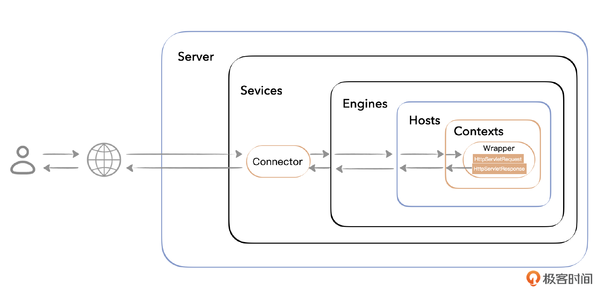
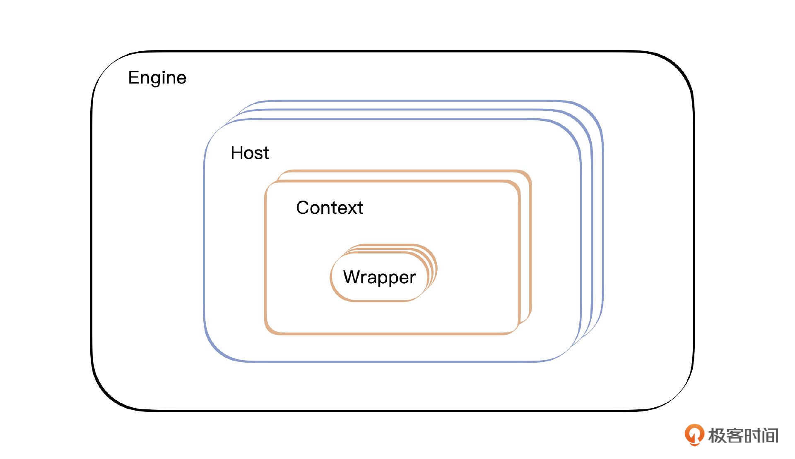
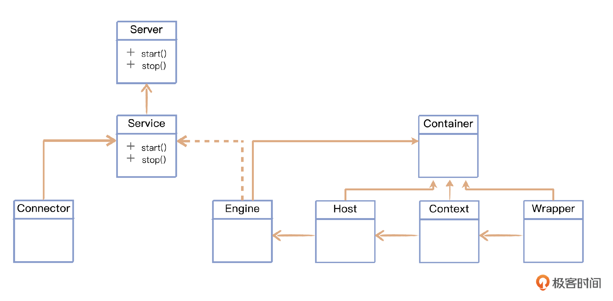
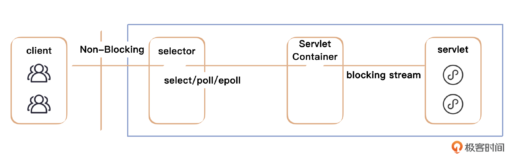
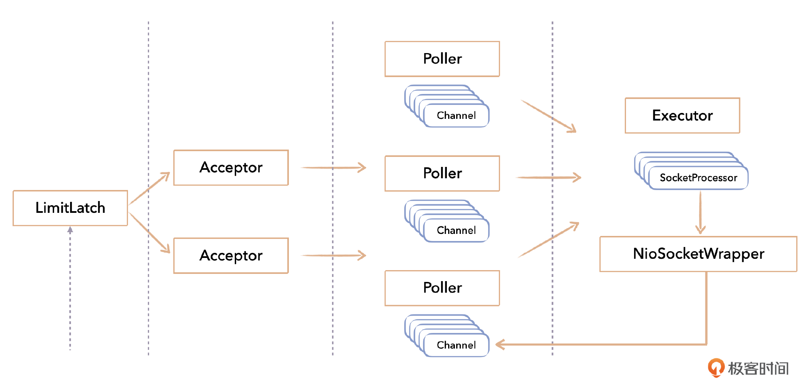
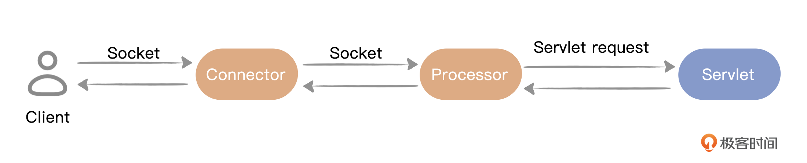
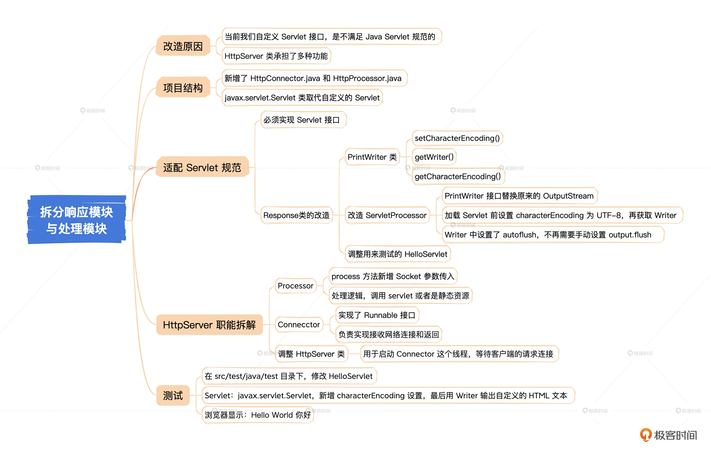
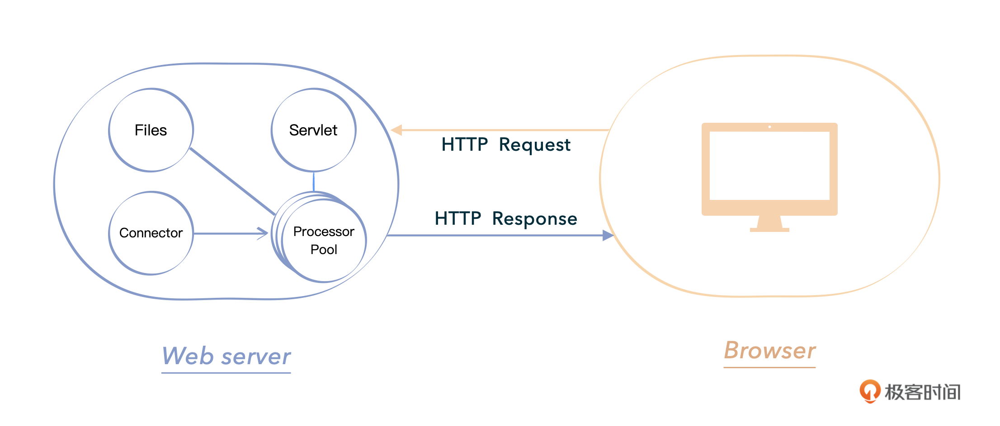
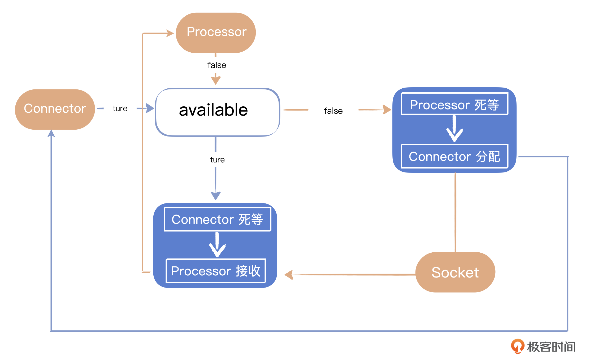

## Tomcat

### 结构


### 如何响应请求

1. 用户在浏览器输入地址，请求被发送到服务器端，按照 Socket 模型，这个访问被一个端口驻守的程序收到，如 8080。在 Tomcat 中，负责这一块的是在那里监听的 Coyote Connector。
2. Connector 解析 Socket 来的请求流，再将该请求交给它所在的 Service 的 Engine 来处理，并等待 Engine 的回应。
3. Engine 获得请求 URI，匹配到合适的虚拟主机 Host。
4. 这个 Host 获得请求串，匹配到合适的 Context。
5. 在 Context 中寻找出对应的 Servlet（其实是一个 Wrapper） 处理数据。
6. 将构造 HttpServletRequest 对象和 HttpServletResponse 对象，作为参数调用 Servlet 的 service() 执行业务逻辑、数据存储等程序。
7. Context 把执行完之后的 HttpServletResponse 对象返回给 Host。
8. Host 把 HttpServletResponse 对象返回给 Engine。
9. Engine 把 HttpServletResponse 对象返回 Connector。
10. Connector 把 HttpServletResponse 对象序列化返回给浏览器。



### 程序结构演化

- 第一步：设计一个简单的 Socket Server
  设计一个 Socket Server，启动后负责监听网络来的请求，获得一个 Socket 连接。然后这个 Server 要解析请求串，知道需要处理什么事情，然后调用相关的程序完成相关任务。最后得到返回处理结果，将这个结果再通过 Socket 传回客户端。

  这个简单的结构很有效，也很简明，但是缺点显而易见：请求监听和处理逻辑放在一起扩展性很差。处理是一个一个串行完成的，性能不好。

- 第二步：将连接与处理分离
  因为第一步显而易见的缺点，所以我们把 Server 拆分成两部分：Connector 和 Processor。Server 只是一个外壳，负责启动。Connector 来负责监听网络来的请求，获得一个 Socket 连接，解析请求后发给 Processor，然后 Processor 调用相关的程序完成相关任务，最后得到返回处理结果，将这个结果返回给 Connector，Connector 再通过 Socket 传回网络客户端。

  经过这一步的分工，Server 的程序结构更加清晰，各司其职。但之前的缺点并没有完全优化，性能问题还没有解决。为了提高性能，需要设计多个 Processor，放到一个池中，支持并发执行。

- 第三步：多层容器 Container
  为了进一步扩展，这一步我们要把后面对 Servlet 的处理分成多层容器，首先是直接包装 Servlet 的 Wrapper，然后对应一个应用 Context，一个 Context 对象会包含多个 Wrapper 对象，用于分别管理多个 Servlet，而 Context 之间是独立的，再往上抽象出 Host 和 Engine。

  结构图如下：
  

  

  + Engine：这个是 Tomcat 的顶层容器，字如其义，一个 Engine 就是一个完整的 Servlet 引擎，它接收来自 Connector 的请求，并传给合适的 Host 来处理，并将结果返回给 Connector。

  + Host：表示一个主机，即一个 Tomcat 可以管理多个虚拟的主机。

  + Context：表示一个 Web 应用，即 WebApp 下的应用。一个 Host 可以有多个 Context。

  + Wrapper：表示一个 Servlet，用来具体处理相应请求。一个 Context 可以有多个 Wrapper。
  
  
  这个多层嵌套的 Container 结构一直保留着，不过从实际效果上看，Engine 和 Host 其实意义不大了，Docker 技术的出现，将 Tomcat 的这个设计变成了鸡肋。

- 第四步：Service

  现在演化到了 Connecter + 多层 Container 这个结构，继续扩展。用 Service 这个概念把 Connector 和 Container 包含进去了。

  

  这样在一个 Server 中可以包含多个 Service，每一个 Service 都是独立的。一个 Service 负责维护多个 Connector 和一个顶层 Container。当需要使用多个端口时，只需要配置多个 Service。

  Tomcat 默认会启动一个名为 Catalina 的 Service。
  

  

- 第五步：生命周期（LifeCycle）

  Tomcat 中每个组件都有生命周期。Connector 和 Container 都实现了 LifeCycle 接口。生命周期有 BEFORE_INIT_EVENT、AFTER_INIT_EVENT、START_EVENT 等状态。生命周期相关的方法有 init()、start()、stop、getState() 等。

- 第六步：引入 NIO

  为了支持高并发，在原有的 BIO 模式下已经很难继续扩展这个能力，于是 Tomcat 6.0 之后引入了 NIO 的支持。结构图示如下：

  
  对 NIO 的支持，宏观上主要影响的是 Connector 这一部分。它是现代 Tomcat 对高并发提供支持的设计，Tomcat 6.0 中就提供了支持，早期的 server.xml 文件中，我们可以看到这么一个配置：

  ```xml
  <Connector connectionTimeout="20000" maxThreads="1000" port="8080" protocol="org.apache.coyote.http11.Http11NioProtocol" redirectPort="8443"/>
  ```

  这就表明它使用了 NIO 模式。


  总体来看，对大规模企业应用，NIO 性能上会明显优于 BIO，所以 Tomcat 9.0 之后干脆就不支持 BIO 模式了。程序模式由 BIO 演化到 NIO，是为了多路复用，技术上是比较困难的，从实际过程来回顾，这一部分的设计也经历了反复。

  开始的结构是这样的：

  

  这个结构很庞大，有多个 Acceptor 和多个 Poller，程序复杂性也高。由于复杂性以及实际效果，后面的版本将这个设计缩了回来，从 Tomcat 9.0 开始，NioEndpoint 结构中 Acceptor 与 Poller 仅支持定义单个 Acceptor 和单个 Poller。也就是说开始的构思有点过度设计了，可见高手也不是一次性能把事情弄好的，凡事都要不断切磋。现在的版本进一步将 NIO 变成了 NIO2，成了完全的异步模式。

## MiniTomcat

我们自己手写 MiniTomcat 的目的是学习 Tomcat，更好地弄懂它。我们也会按照由简到繁的过程一步步构建，因为我们知道了 Tomcat 本身的发展过程，所以也按照它的过程一步步走过来。自己手写一遍是最好的学习方式，纸上得来终觉浅，绝知此事要躬行。


实际上，我们只会走到第四步，也就是 Connector + 多层 Container。这么考虑的原因是后面的内容难度比较高，篇幅也多，应当单独成书，未来有机会我们再公布出来。到了第四步，Tomcat 早期版本的核心部分也都包含进来了，对应着 Tomcat 6.0 之前的状况。

我们在今后的学习过程中，心里要有这个大图景。

### 一、基础设计

#### 构造一个极简的HttpServer

启动一个 ServerSocket 接收客户端的请求，生成 Socket 连接后包装成 Request/Response 进行处理

#### 按照规范构造返回流

新增对是否为 Servlet 的判断，不同的请求调用不同的ServletProcessor

### 二、连接层设计

#### 拆分响应模块和处理模块

将 HttpServer 功能进行拆分解耦，分成 Connector 和 Processor，Connector 负责实现接收网络连接和返回，Processor 负责处理逻辑，即调用 Servlet 并返回。各个部分各司其职，并且考虑实现 Runnable 接口支持独立线程并发调用，为未来提高整体性能做准备。




总结：




#### Server性能提升：设计多个Processor

引入池的概念，增强 Processor 的复用性，同时将 Processor 异步化，支持一个 Connector 服务于多个 Processor。



设置多线程的Processor

基本的思路是使用多个线程，让 Connector 和 Processor 分别由不同的线程来运行。工作的基本流程是由 Connector 接收某个 Socket 连接后交给某个 Processor 线程处理，而 Processor 线程等待某个 Socket 连接到来后进行处理，处理完毕之后要交回给 Connector。因此，这里的核心是要设计一个线程之间的同步机制。


- 首先我们让 HttpProcessor 实现 Runnable 接口，这样每一个 HttpProcessor 都可以在独立的线程中运行。改造如下：
  ```java
  public class HttpProcessor implements Runnable{
      @Override
      public void run() {
          while (true) {
              // 等待socket分配过来
              Socket socket = await();
              if (socket == null) continue;
              // 处理请求
              process(socket);
              // 回收processor
              connector.recycle(this);
          }
      }
  }
  ```

  

上述 Processor 的 run() 方法执行过程是，等待某个 Socket，收到 Connector 交过来的 Socket 后，Process 方法处理这个 Socket，处理完毕之后交回给 Connector 回收，并重新把这个 processor 放入池里。

这是 Processor 接收者这一边，而另一边就是作为分配者的 Connector。类似地，我们提供一个 assign 方法让 Connector 分配 Socket 给 Processor。

接下来我们重点解决分配者和接收者如何同步的问题。因为这是两个线程，一定需要同步才能协同工作。基本的思路就是 await() 方法里等着 Socket，而 assign() 方法里分配 Socket，中间通过一个标志来表示分配和接收状态，以此进行同步。

这个同步的机制内部其实就是用的 Java 自身提供的 notify 和 wait。

看程序代码，如下所示：

```java
synchronized void assign(Socket socket) {
    // 等待connector提供一个新的socket
    while (available) {
        try {
            wait();
        } catch (InterruptedException e) {
        }
    }
    // 获取到这个新的Socket
    this.socket = socket;
    // 把标志设置回去
    available = true;
    //通知另外的线程
    notifyAll();
}
private synchronized Socket await() {
    // 等待connector提供一个新的socket
    while (!available) {
        try {
            wait();
        }catch (InterruptedException e) {
        }
    }
    // 获得这个新的Socket
    Socket socket = this.socket;
    //设置标志为false
    available = false;
    //通知另外的线程
    notifyAll();
    return (socket);
}
```

首先看 assign(socket) 方法，在这里，我们用一个标志 available 来标记，如果标志为 true，Connetor 线程就继续死等。到了某个时候，Processor 线程把这个标志设置为 false，Connector 线程就跳出死等的循环，然后把接收到的 Socket 交给 Processor。然后要立刻重新把 available 标志设置为 true，再调用 notifyAll() 通知其他线程。

再看 await()，这是作为接收者 Processor 的线程使用的方法。反过来，如果 avaliable 标志为 false，那么 Processor 线程继续死等。到了某个时候，Connector 线把这个标志设置为 true，那么 Processor 线程就跳出死等的循环，拿到 Socket。然后要立刻重新把 avaiable 标志设置为 false，再调用 notifyAll() 通知其他线程。

这个线程互锁机制保证了两个线程之间的同步协调。图示如下:



在 HttpProcessor 的线程启动之后，available 的标识一直是 false，这个时候这个线程会一直等待。在 HttpConnector 类里构造 Processor，并且调用 processor.assign(socket) 给 HttpProcessor 分配 Socket 之后，标识符 available 改成 true，并且调用 notifyAll 这个本地方法通知唤醒所有等待的线程。

而在 await 方法里，HttpProcessor 拿到 HttpConnector 传来的 Socket 之后，首先会接收 Socket，并且立即把 available 由 true 改为 false，最后以拿到的这个 Socket 为基准继续进行 Processor 中的处理工作。

这也意味着，一旦 Connector 分配了一个 Socket 给到 Processor，后者就能立即结束等待，拿到 Socket 后调用 Process 方法继续后面的工作。这时 available 的状态立刻修改，进而用 notifyAll 方法唤醒 Connector 的等待线程，Connector 就可以全身而退，去处理下一个 HttpProcessor 了。

#### 

