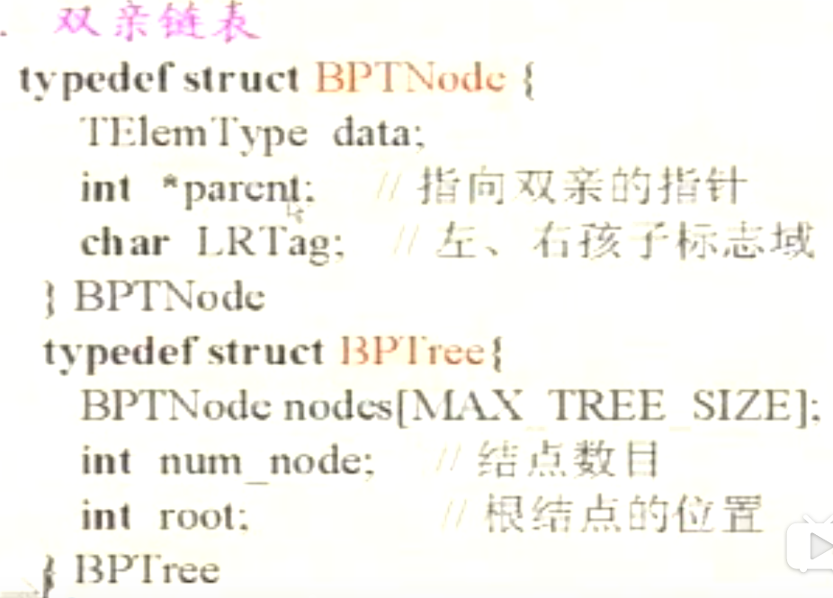
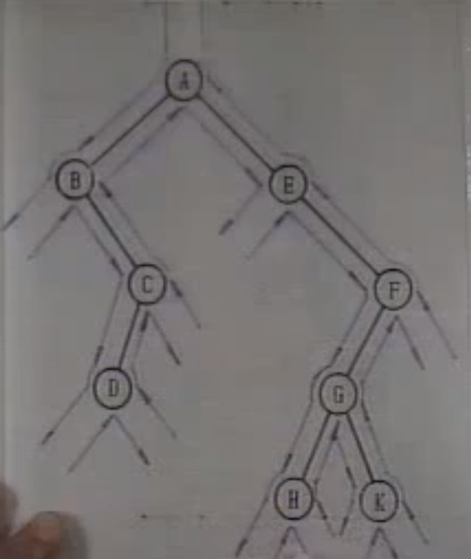
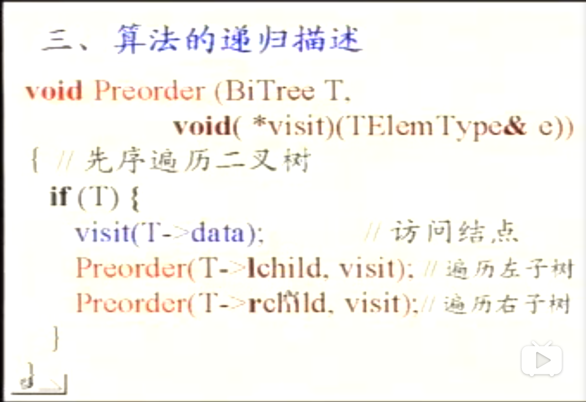
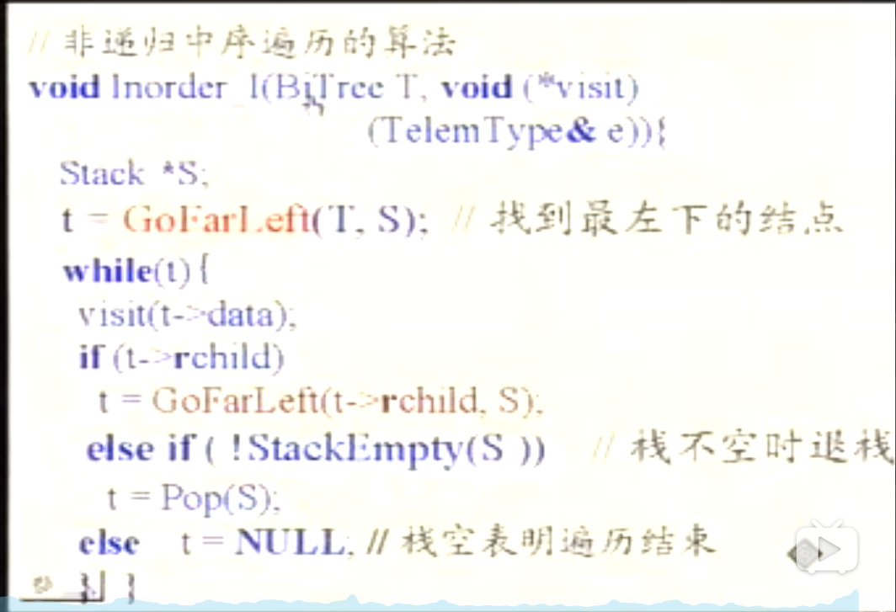

# 二叉树的基本操作

## 二叉树的重要特性

1. 在二叉树的第i层上最多有$2^{i-1}$个节点（$i>1$）

     数学归纳法  
     
     |根节点		|i=1                    |$\ 2^0$  
     
     |……     	     |……                    |……
     
     |第k行          |  i=k                   | $\ 2^{k-1}$
     
     | 第k+1行 	| i=k+1               |  $\ 2^{(k-1)}*2 $    (每个节点最多有两个节点) 
     
2. 深度为k的二叉树上至多含$2^k-1$个节点($i>1$)
  
3. 对于任何一个二叉树，若它含有$n_0$个叶子节点，$n_2$个度为2的节点，则必存在关系式：$n_o=n_2+1$ 
  
   $n_0+n_1+n_2=n$ （n为总结点数，$n_1$为度为一的节点数，$n_0$为度为0的节点数）
  
   $n=b+1$ (b为分支数，度为1的节点产生一个分支，度为2的产生的两个，度为0的节点不产生)
  
   $n_1+2*n_2+1=n=b+1$ 
  
4. 满二叉树:指的是深度为k且含有$2^k-1$个结点的二叉树
  
   完全二叉树：树中所含的n个节点和满二叉树中编号为1至n的节点一一对相应
  
   具有n个节点的完全二叉树的深度为$\lfloor log_2^n\rfloor+1$ 
  
   $z^{k-1}-1<n<=2^k-1$ 
  
   $z^{k-1}<=n<2^k$ 
  
   $k-1<=log_2^n<k$ 
  
5. 若对含n个结点的二叉树从上到下，且从左至右进行1至n的编号，则对二叉树中任意一个编号为i的节点：
  
   - 若i=1，则该节点是二叉树的根，无双亲，否则编号为$\lfloor i/2\rfloor$ 的节点为其双亲结点。
   - 若$2i>n$，则该节点无左孩子，否则，编号为$2i$的节点为其左孩子的节点。
   - 若$2i+1>n$ 则该节点无右孩子节点，否则，编号为$2i+1$的节点为其右孩子节点。


## 二叉树的存储结构

### 二叉树的顺序存储表示

```c
#define MAX_TREE_SIZE 100
        //二叉树的最大节点数
typedef TELemType SqBiTREE[MAX_TREE_SIZE];
         //0号单元存储根节点
SqBiTree BT;
```


### 二叉树的链式存储表示

- 二叉链表

  ```c
  typedef struct BiTNode{
      TElemType data;
      Struct BiTnode *lchild,*rchild;
  }BITNode,*BiTree
  ```

  

- 三叉链表

  ```c
  typedef struct TriTNode{
      TElemType data;
      struct TriTNode *lchild,*rchild;
      struct TriTNode *parent;
  }TriTNode,*TriTree
  ```

- 双亲链表

  
  
- 线索链表

## 二叉树的遍历

#### 路径：

- 先上后下的按层遍历

- 先左（子树）后右（子树）的遍历

- 先右（子树）后左（子树）的遍历

#### 先左后右的遍历



- 先（根）序的遍历算法

  ``a b c d e f g h k ``

- 中（根）序的遍历算法
  ``b d c a e h g k f``

- 后（根）序的遍历算法

  ``d c b h k g f e a`` 

#### 算法的递归描述



#### 中序遍历的非递归描述

通过栈记录有左子树的节点，一直到左子树为空，访问元素，然后访问右子树，再访问左子树，入栈，如果右子树为空，回退，弹栈。




#### 用法

- 叶子节点数量（先序遍历）
- 求二叉树的深度（后序遍历）
- 复制二叉树（后序遍历）

## 线索二叉树

### 定义

遍历二叉树的结果是，求得节点的一个线性序列（对二叉树的线性化的结果）

- 指向该线性序列中的``前驱``和``后继``的指针，称作``线索``
- 包含``线索``的存储结构，称作做``线索链表``
- 于其相应的二叉树，``线索二叉树`` 

### 线索链表的遍历算法


### 如何建立线索链表

## 二叉树的查找

## 二叉树的插入

- 初始化
- 修改
- 创建
- 插入

## 二叉树的删除

- 清理空
- 销毁结构
- 删除子树